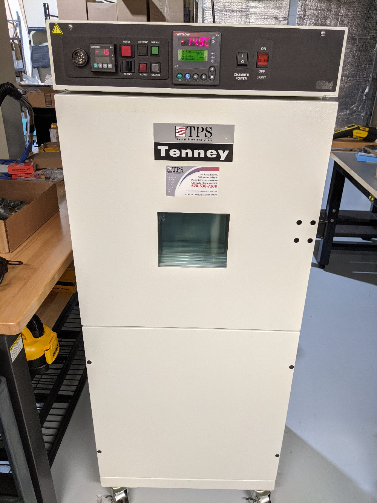
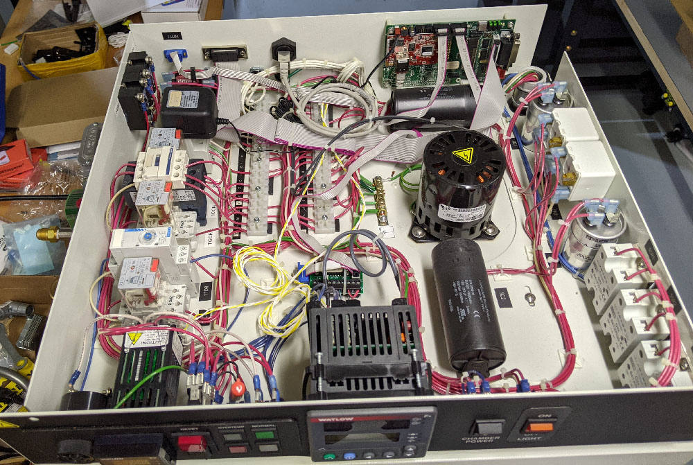

# Tenny TUJR Thermal Chamber Details



This repo holds some various documentation collected around our Tenny TUJR thermal chamber.

Note that there appear to be *many* options on these units, so be aware your unit may have different controllers, wiring, options, etc.

## Interface Board

Our thermal chamber had what appeared to be Ethernet, RS232 (DB9), and GPIB ports on the backside. On opening the wiring these units are connected to the [Synergy488](https://www.tidaleng.com/synergy488.htm) board:



Unfortunately the software caused Windows to blue-screen, and it does not appear it has any well documented commands. The description of this board is primary just as an interface board and *not* related to the control (which is handled entirely by the Watlow F4).

The simple app provided by Tidal Engineering did not show a successful connection on RS232, and the Ethernet port showed no activity either (connecting it to a switch does not even detect it). This leads me to assume the board is dead or requires more advanced troubleshooting -- as it seems to be of questionable value I just bypassed it entirely.

## Watlow DB9/RS232 Connection

The DB9 connector on the backside of the unit was routed to the Watlow RS232 lines. This was easily done with the breakout board which was previously routed to the Synergy488. The same 10-pin header worked with the cable used for the rear panel DB9, so I didn't need to replace anything even.

## Watlow F4 Python Library

Only needing basic temperature logging & control I wrote a basic library based on `pymodbus` (install with `pip install pymodbus`).

To set the process temp, read the current process temp, and read actual temperature of the unit:

```python
    chamber = WatlowF4Chamber("com3")

    chamber.set_process_temp(-22.1)

    print("Setpoint = {} °C".format(chamber.get_process_temp()))

    print("Actual = {} °C".format(chamber.read_temp()))
```

This assumes you are physically turning the chamber on/off switch to 'on'. The Watlow F4 only controls the heater or compressor, the fan is always controlled by the physical switch. This means the best 'remote on/off' you could do is at least to avoid cycling the heater/compressor, but the fan would always be running.

The library will try talking to the unit and confirm the settings are working on the init call. If this fails check:

* RS232 TXD/RXD are routed correctly (swap RX/TX if unsure).
* Baud rate is set to `19200` in `communications` setup menu.
* Address is set to `1` in `communications` setup menu.